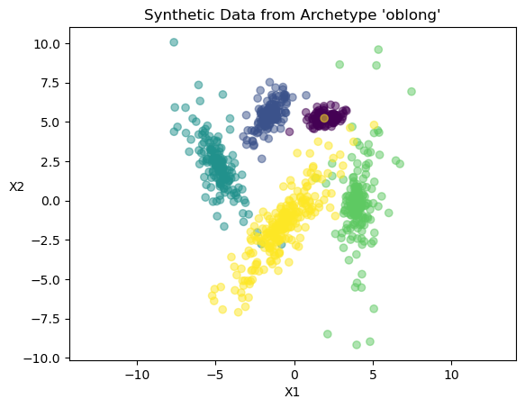

Basic Usage
~~~~~~~~~~~

Generating synthetic data sets with ``repliclust`` is based on data set
*archetypes*. You use an ``Archetype`` object to encode your preferences
for the overall geometry of your synthetic data sets. After specifying
the desired archetype, you feed the archetype into a ``DataGenerator``
object. You can then generate synthetic data sets on command using the
“loaded” ``DataGenerator``.

We run through a simple example below. After importing ``repliclust``,
we define an archetype `my_archetype`. In defining the archetype, we
set a few basic attributes: the number of clusters (5), the
dimensionality (2), and the total number of samples (1000). In addition,
we set the reference aspect ratio (``aspect_ref``) to 3. The latter
setting implies that the clusters in each synthetic data set are
somewhat oblong rather than round.

.. code:: ipython3

    from repliclust import Archetype, DataGenerator
    
    my_archetype = Archetype(n_clusters=5, dim=2, n_samples=1000,
                             aspect_ref=3, name="oblong")
    data_generator = DataGenerator(archetype=my_archetype)

After feeding `my_archetype` into `data_generator`, we can
immediately start generating synthetic data sets. One way to do this is
by calling ``DataGenerator.synthesize()``. The output of this function
is a tuple ``X, y, archetype_name``, where ``X`` is the data set, ``y``
are the cluster labels, and ``archetype_name`` is the name of the
archetype. (If we had not specified the name as “oblong”, ``repliclust``
would have automatically assigned a default name such as “archetype0”.)
First, however, we call ``repliclust.set_seed`` to set a random seed for
reproducibility.

.. code:: ipython3

    from repliclust import set_seed
    set_seed(0)
    X, y, archetype_name = data_generator.synthesize()

.. parsed-literal::

    
    [=== optimizing cluster overlaps ===]
    
                     ...
    
    [====== completed in 13 epochs =====]
    

The print output above indicates that ``repliclust`` managed to find
clusters with the required overlaps within 13 epochs of the optimization
algorithm. We will describe in subsequent sections how to change the
desired overlaps specified by an archetype.

Below, we visualize the synthetic data set we have just generated, using
``matplotlib``. We set the same scaling for the `X1` and `X2` axes
so that we can judge whether the output clusters are truly oblong. This
cell below is a continuation of the previous cell.

.. code:: ipython3

    import matplotlib.pyplot as plt
    
    plt.scatter(X[:,0],X[:,1],c=y,alpha=0.5)
    plt.title("Synthetic Data from Archetype '"
                + archetype_name + "'")
    plt.xlabel('X1')
    plt.ylabel('X2').set_rotation(0)
    plt.axis('equal');

The scatter plot above confirms that the clusters are indeed oblong
rather than spherical.