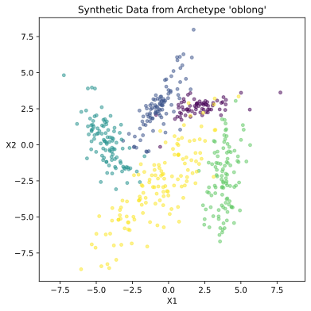

Basic Usage
~~~~~~~~~~~

Generating synthetic data sets with ``repliclust`` is based on data set
*archetypes*. You use an ``Archetype`` object to encode your preferences
for the overall geometry of your synthetic data sets. After specifying
the desired archetype, you define a ``DataGenerator`` object based on
your desired archetype(s). You can then generate synthetic data sets 
on command.

We run through a simple example below. After importing ``repliclust``,
we define an archetype `archetype_oblong` to create synthetic data with
oblong clusters. In defining the archetype, we set a few basic
attributes: the number of clusters (5), the dimensionality (2), and the
total number of samples (1000). To make the archetype oblong, we set
``aspect_ref=3``, which gives the typical cluster an aspect ratio of
three. The choice ``aspect_maxmin=1.5`` creates some variability in the
cluster aspect ratio, making some clusters a bit more oblong than
others.

.. code:: ipython3

    from repliclust import Archetype, DataGenerator

    archetype_oblong = Archetype(n_clusters=5, dim=2, n_samples=500,
                                 aspect_ref=3, aspect_maxmin=1.5,
                                 name="oblong")
    data_generator = DataGenerator(archetype=archetype_oblong)

After defining the `data_generator` based on `archetype_oblong`, we can
immediately start generating synthetic data sets with oblong clusters.
One way to do this is by calling the method 
:py:meth:`synthesize() <repliclust.base.DataGenerator.synthesize>`.
The output of this method is a tuple `(X, y, archetype_name)`, where
`X` is the dataset, `y` are the cluster labels, and `archetype_name`
is the name of the archetype. (If we had not specified the name as
“oblong”, ``repliclust`` would have automatically assigned a default
name such as “archetype0”.)

The simulation below shows how to generate synthetic data based on our
current setup. Before running the code below, first run the code above
to define the archetype and data generator.

.. code:: ipython3

    import matplotlib.pyplot as plt

    from repliclust import set_seed

    set_seed(0)
    X, y, archetype_name = data_generator.synthesize()

    plt.scatter(X[:,0], X[:,1], c=y, alpha=0.25)
    plt.title("Synthetic Data from Archetype '"
                + archetype_name + "'")
    plt.xlabel('X1')
    plt.ylabel('X2').set_rotation(0)
    plt.axis('equal');

The function :py:func:`set_seed() <repliclust.base.set_seed>` sets a
random seed to make data generation reproducible.

The scatter plot above confirms that the clusters in our synthetic
dataset are indeed oblong. We discuss how to customize archetypes in
section :ref:`Specifying an Archetype <specifying_an_archetype>`.

