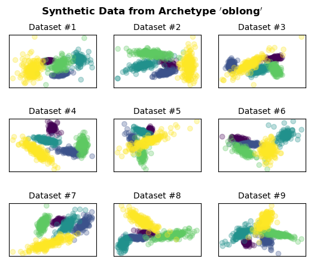

Generating Multiple Similar Datasets
^^^^^^^^^^^^^^^^^^^^^^^^^^^^^^^^^^^^^

Using ``repliclust``, you can generate many different synthetic data
sets that all look similar. To illustrate, we will now generate 9
different data sets based on the “oblong” archetype defined in the
:doc:`basic_usage` section. In the cell below, we define the archetype
again for convenience.

.. code:: ipython3

    from repliclust import Archetype, DataGenerator, set_seed
    set_seed(1)

    my_archetype = Archetype(n_clusters=5, dim=2, n_samples=1000,
                             aspect_ref=3, name="oblong")
    data_generator = DataGenerator(archetype=my_archetype)
    
    fig, ax = plt.subplots(nrows=3, ncols=3)
    
    for i in range(3):
        for j in range(3):
            X, y, archetype_name = data_generator.synthesize(quiet=True)
            ax[i,j].set_title('Dataset #' + str(i*3 + (j+1)), fontsize=10)
            ax[i,j].scatter(X[:,0],X[:,1],c=y, alpha=0.3)
            ax[i,j].set_xticks([]); ax[i,j].set_yticks([])
    
    plt.subplots_adjust(hspace=0.6)
    fig.suptitle(r"$\bf{Synthetic~Data~from~Archetype~'"
                + archetype_name + r"'}$");

Setting the option ``quiet=True`` in the call to
``DataGenerator.synthesize`` avoids printing status updates during data
generation.