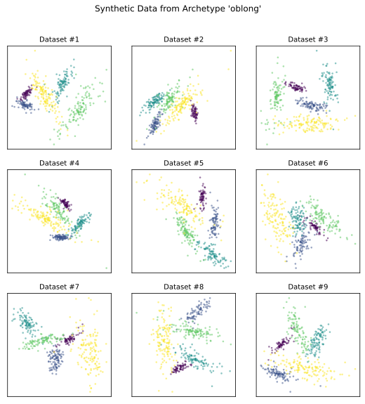

Generating Multiple Similar Datasets
^^^^^^^^^^^^^^^^^^^^^^^^^^^^^^^^^^^^^

Using ``repliclust``, you can generate many different synthetic data
sets that all look similar. To illustrate, we will now generate nine
different data sets based on the “oblong” archetype defined in the
:doc:`basic_usage` section. In the simulation below, we define the
archetype and data generator again for convenience.

.. code-block:: python

    import matplotlib.pyplot as plt
    from repliclust import Archetype, DataGenerator, set_seed

    set_seed(1)

    archetype_oblong = Archetype(n_clusters=5, dim=2, n_samples=500,
                                aspect_ref=3, aspect_maxmin=1.5,
                                name="oblong")
    data_generator = DataGenerator(archetype=archetype_oblong)

    fig, ax = plt.subplots(figsize=(9,9), dpi=300, nrows=3, ncols=3)

    for i in range(3):
        for j in range(3):
            X, y, archetype = data_generator.synthesize(quiet=True)
            ax[i,j].set_title('Dataset #' + str(i*3 + (j+1)), fontsize=10)
            ax[i,j].scatter(X[:,0],X[:,1],c=y, s=5, alpha=0.5, linewidth=0.3)
            ax[i,j].set_xticks([]); ax[i,j].set_yticks([])

    plt.subplots_adjust(hspace=0.20)
    fig.suptitle("Synthetic Data from Archetype '"
                + archetype.name + "'", y=0.97)

Setting the option ``quiet=True`` in the call to
:py:meth:`synthesize() <repliclust.base.DataGenerator.synthesize>`
avoids printing status updates during data generation.