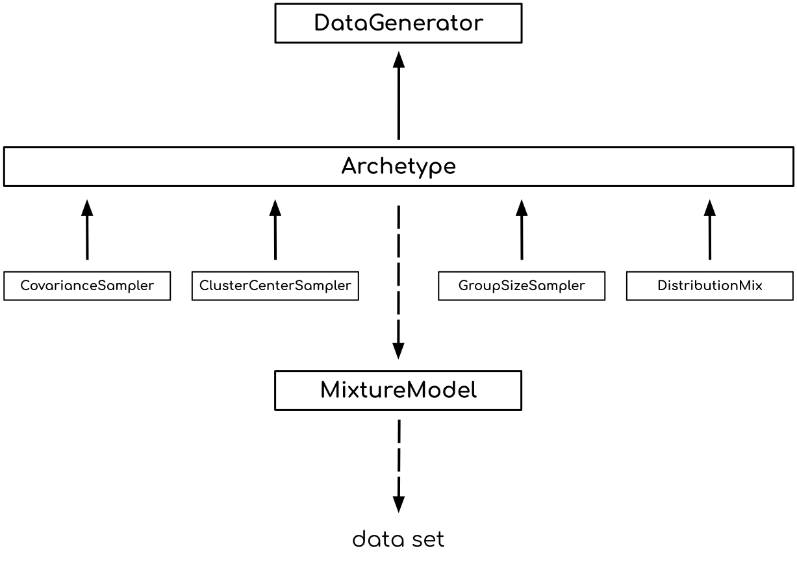

Reference
=========

These pages provide a reference for **repliclust**. 

The diagram below shows our object-oriented software architecture from a
big picture perspective.

A :py:class:`DataGenerator <repliclust.base.DataGenerator>` depends on
one or several :py:class:`Archetype <repliclust.base.Archetype>`'s to
produce synthetic data sets. Each :py:class:`Archetype <repliclust.base.Archetype>`
generates :py:class:`MixtureModel <repliclust.base.MixtureModel>`'s
which, in turn, sample ready-to-use synthetic data sets.

In the diagram, each box represents an object. A solid arrow
*A* <-- *B* means that *B* is an attribute of *A*, while a dashed
arrow *X* - -> *Y* means that *X* randomly samples instances of
*Y*. The objects of type
:py:class:`CovarianceSampler <repliclust.base.CovarianceSampler>`, 
:py:class:`ClusterCenterSampler <repliclust.base.ClusterCenterSampler>`,
:py:class:`GroupSizeSampler <repliclust.base.GroupSizeSampler>`,
and
:py:class:`DistributionMix <repliclust.base.DistributionMix>` are the
modular building blocks an archetype uses to sample mixture models.

The API reference below allows you to look up the definitions of 
individual classes and functions in **repliclust**.

.. toctree::

   base
   maxmin
   overlap
   distributions

