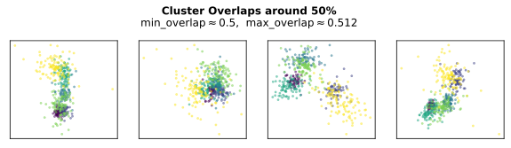
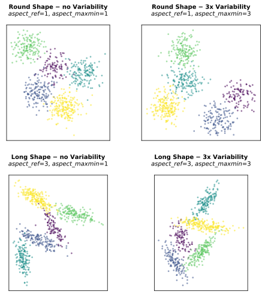
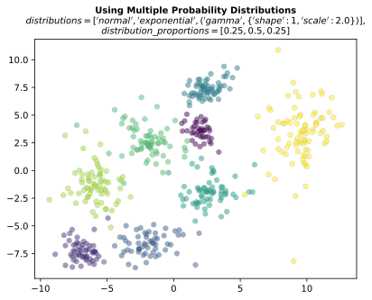

.. _specifying_an_archetype:

Specifying an Archetype
~~~~~~~~~~~~~~~~~~~~~~~

In this section, we explain how to customize a data set archetype to
obtain synthetic data that suits your needs.

.. _basic_parameters:

Basic Parameters
^^^^^^^^^^^^^^^^

Basic parameters of each :py:class:`Archetype <repliclust.base.Archetype>`
include the desired number of clusters `n_clusters`,
the number of dimensions `dim` of the data, the desired total number of
data points `n_samples` in each synthetic
dataset and the name of the archetype (`name`).

Overlaps Between Clusters
^^^^^^^^^^^^^^^^^^^^^^^^^

We quantify the overlap between any pair of clusters as a percentage.
Roughly, an overlap of 0.05 indicates that the outer 5% of the clusters’
probability densities overlap.

In a data set with *k* clusters, there are *k(k-1)/2* pairs of clusters.
To quantify the desired overlap for the whole data set, you can use the
parameters :py:obj:`min_overlap <repliclust.maxmin.archetype.MaxMinArchetype>`
and :py:obj:`max_overlap <repliclust.maxmin.archetype.MaxMinArchetype>`.
The latter parameter imposes an upper limit on the overlap between any
pair of clusters. Hence, decrease `max_overlap` if you want to ensure
that clusters are farther apart. On the other, `min_overlap` sets a
lower limit on the overlap between a cluster and its closest neighbor.
In other words,
increase `min_overlap` if you want to avoid isolated clusters. Choose
similar values for `min_overlap` and `max_overlap` if you would like
to impose a consistent overlap across all synthetic data sets. However,
keep in mind that `max_overlap` must always exceed `min_overlap`; in
addition, when the gap between `min_overlap` and `max_overlap` is
too small, data generation may take unacceptably long.

The simulation below generates synthetic data sets for various choices
of `min_overlap` and `max_overlap`. We discuss the results below.

.. code:: ipython3

    from repliclust import set_seed, Archetype, DataGenerator
    import matplotlib.pyplot as plt

    set_seed(2)
    eps = 1e-4

    overlap_settings = [{'min_overlap': 1e-3, 'max_overlap': 1e-3+eps},
                        {'min_overlap': 1e-3, 'max_overlap': 0.5},
                        {'min_overlap': 0.5, 'max_overlap': 0.5+eps}]

    for i, overlaps in enumerate(overlap_settings):
        fig, ax = plt.subplots(figsize=(10,2),dpi=300,nrows=1, ncols=4)
        description = (
            r"$\bf{Cluster~Overlaps~around~0.1\%}$" if i==0
                else (r"$\bf{Cluster~Overlaps~between~0.1\%~and~50\%}$" if (i==1)
                    else r"$\bf{Cluster~Overlaps~around~50\%}$")
            )
        fig.suptitle(description + '\n'
                        + "min_overlap" + r"$ \approx $"
                        + str(overlaps['min_overlap'])
                        + ",  max_overlap" + r"$ \approx $"
                        + str(round(overlaps['max_overlap'],3)),
                    y=1.15)
        for j in range(4):
            archetype = Archetype(
                            min_overlap=overlaps['min_overlap'],
                            max_overlap=overlaps['max_overlap']
                            )
            X, y, archetype_name = (DataGenerator(archetype)
                                        .synthesize(quiet=True))
            ax[j].scatter(X[:,0], X[:,1], c=y, alpha=0.25)
            ax[j].set_xticks([]); ax[j].set_yticks([]) 
            fig.subplots_adjust(hspace=0.5)

.. image:: ./user_guide_img/3_0.svg

.. image:: ./user_guide_img/3_1.svg

The plots above demonstrate the impact of varying `min_overlap` and
`max_overlap`. The middle series of plots shows that
the difference between `max_overlap` and `min_overlap` plays an
important role as well.

In the top row of plots, ``min_overlap=0.001`` and
``max_overlap=0.0011``. The small difference between ``max_overlap``
and ``min_overlap`` means that we are controlling cluster overlap
rather tightly around 0.1%. Not only must no pair of clusters overlap
more than 0.1%, but also each cluster
must overlap at least 0.1% with its closest neighbor. The bottom row
paints a similar picture, except with more overlap between clusters
(50% vs 0.1%).

The middle row shows a different scenario because we leave a
substantial gap between ``min_overlap=0.001`` and ``max_overlap=0.5``.
In this case, all clusters must overlap less than 50%, but we permit
much smaller overlaps. This choice increases the variability of
synthetic data sets because within the range of 0.001 to 0.5 we leave
the actual overlaps to chance. For example, the clusters in the 
second data set from the left overlap more than those in the third data
set. Such variation may or not be helpful for your application.

Cluster Aspect Ratios
^^^^^^^^^^^^^^^^^^^^^

Each cluster has an ellipsoidal shape that may be round like a ball, or
long and slender like a rod. The *aspect ratio* of a cluster is the
ratio of the length of its longest axis to the length of its shortest
axis. In other words, a high aspect ratio indicates a long and slender
cluster, whereas a low aspect ratio indicates a round cluster. Possible
values for the aspect ratio range from 1 (a perfect sphere) to
infinitely large.

When generating synthetic data using ``repliclust``, you can influence
the cluster aspect ratios by changing the parameters
:py:obj:`aspect_ref <repliclust.maxmin.archetype.MaxMinArchetype>`
and :py:obj:`aspect_maxmin <repliclust.maxmin.archetype.MaxMinArchetype>`.
The reference aspect ratio, `aspect_ref`, determines the typical aspect
ratio for all clusters in a synthetic data set. For example, if
``aspect_ref=3``, the typical cluster is oblong with an aspect ratio of
three. On the other hand, the max-min ratio `aspect_maxmin` determines
the variability of cluster aspect ratios within the same data set.
More precisely, `aspect_maxmin` is the ratio of the highest aspect ratio
to the lowest aspect ratio in each data set. For example, if
``aspect_maxmin=3``, then the "longest" cluster is four
times longer than the most "round" cluster.

The simulation below demonstrates the effect of changing 
`aspect_ref` and `aspect_maxmin`.

.. code:: ipython3

    import matplotlib.pyplot as plt
    import repliclust
    repliclust.set_seed(1)

    fig, ax = plt.subplots(figsize=(8,8), dpi=300, nrows=2, ncols=2)

    for i, aspect_ref in enumerate([1, 3]):
        for j, aspect_maxmin in enumerate([1, 3]): 
            archetype = repliclust.Archetype(n_clusters=5, n_samples=750,
                                            aspect_ref=aspect_ref,
                                            aspect_maxmin=aspect_maxmin,
                                            radius_maxmin=1.0,
                                            min_overlap=0.04,
                                            max_overlap=0.05,
                                            distributions=['normal'])
            X, y, _ = repliclust.DataGenerator(archetype).synthesize(quiet=True)
            ax[i,j].scatter(X[:,0], X[:,1],c=y, alpha=0.25)
            aspect_ref_description = (r"$\bf{Round~Shape}$" if (i==0)
                                    else r"$\bf{Long~Shape}$")
            aspect_maxmin_description = (r"$\bf{-~no~Variability}$" if (j==0)
                                    else r"$\bf{-~3x~Variability}$")
            ax[i,j].set_title(aspect_ref_description + " "
                            + aspect_maxmin_description + "\n"
                            +r"$ aspect\_ref $=" + str(aspect_ref) + ", "
                            +r"$ aspect\_maxmin $=" + str(aspect_maxmin),
                            fontsize=10, y=1.05)
            ax[i,j].set_aspect('equal')
            ax[i,j].set_xticks([]); ax[i,j].set_yticks([]) 
            plt.subplots_adjust(hspace=0.3, wspace=0.15)

Cluster Volumes
^^^^^^^^^^^^^^^

The volume of a cluster is the volume spanned by the inner 75% of its
probability mass. Since cluster volume grows rapidly in high dimensions,
we quantify the spatial extent of a cluster in terms of its radius
instead. The radius of an ellipsoidal cluster is the spherical radius
of a ball with the same volume.

When generating synthetic data with ``repliclust``, you can influence
the variability in cluster volumes by changing the
:py:obj:`radius_maxmin <repliclust.maxmin.archetype.MaxMinArchetype>`
parameter. This parameter sets the ratio between the
largest and smallest cluster radii within a data set. For example, if
`radius_maxmin` is 10 and the smallest cluster has unit radius, then the
biggest cluster has a radius of 10. Note that volumes scale
differently from radii. In *dim* dimensions, ``radius_maxmin=10``
implies that the biggest cluster volume is `10**dim` times
greater than the smallest.

The simulation below demonstrates the effect of varying
``radius_maxmin``.

.. code:: ipython3

    import repliclust
    import matplotlib.pyplot as plt
    repliclust.set_seed(1)

    fig, ax = plt.subplots(figsize=(10,3.3), dpi=300, nrows=1, ncols=3)

    for i, radius_maxmin in enumerate([1,3,10]):
        archetype = repliclust.Archetype(radius_maxmin=radius_maxmin,
                                        max_overlap=0.05,min_overlap=0.04)
        X, y, _ = repliclust.DataGenerator(archetype).synthesize(quiet=True)
        description = (
            r"$\bf{Equal~Cluster~Volumes}$" 
                if i==0
                else (r"$\bf{3x~Variability}$"
                    if (i==1)
                    else r"$\bf{10x~Variability}$")
            )
        ax[i].scatter(X[:,0], X[:,1], c=y, alpha=0.25)
        ax[i].set_xticks([]); ax[i].set_yticks([]) 
        ax[i].set_title(description + '\n'
                        + r'$ radius\_maxmin $'+ " = " + str(radius_maxmin))

.. image:: ./user_guide_img/5.svg

Cluster Probability Distributions
^^^^^^^^^^^^^^^^^^^^^^^^^^^^^^^^^

Each cluster consists of data points spread around a central point
according to a probability distribution. While a cluster’s overall
ellipsoidal shape depends on its covariance matrix, the choice of
probability distribution determines how quickly the density of data 
points drops with increasing
distance from the central point. For example, the `normal`
distribution spreads all data points rather tightly around the central
point. By contrast, the `exponential`
distribution spreads the probability mass further out in space, leaving
a larger share of data points away from the cluster center.
Going even further, heavy-tailed distributions such as the
`standard t` distribution
with ``df=1`` degrees of freedom give rise to *outliers*, data points
very far from the cluster center.

When generating synthetic data using ``repliclust``, you can use the
``distributions`` parameter to customize the probability distributions
appearing in your synthetic data sets. As an example, the scatter plots
below visualize the differences between the normal,
exponential, and standard t distributions.

.. image:: ./user_guide_img/6.svg

Note the vastly different scales of the 
`X1` and `X2` axes. On the left, the normal distribution keeps all 
data points within about two units of distance from the cluster center.
On the right, the heavy-tailed standard t distribution leads to outliers
as far as 200 units away. The exponential distribution in the middle
strikes a compromise, with distances of up to about five units from the
center.

Besides choosing a single probability distribution, you can use multiple
distributions. This choice leads to synthetic 
data sets in which different clusters have different probability
distributions. In general, the parameter ``distributions`` is a list
containing the names of all probability distributions, as well as their
parameters. Not all distributions have parameters. To obtain a list of
the probability distributions currently supported in ``repliclust``, as
well as their parameters, call ``get_supported_distributions()``.

.. code:: ipython3

    from repliclust import get_supported_distributions
    get_supported_distributions()

.. parsed-literal::

    {'normal': {},
     'standard_t': {'df': 1},
     'exponential': {},
     'beta': {'a': 0.3, 'b': 0.5},
     'chisquare': {'df': 1},
     'gumbel': {'scale': 1.0},
     'weibull': {'a': 2},
     'gamma': {'shape': 0.5, 'scale': 1.0},
     'pareto': {'a': 1},
     'f': {'dfnum': 1, 'dfden': 1},
     'lognormal': {'sigma': 1.0}}

It is important to
spell the names of distributions exactly as shown above. All names are
adapted from the ``numpy.random.Generator`` module. To understand the 
meaning of the distributional parameters, see the ``numpy``
documentation. For example, click `here <https://numpy.org/doc/stable/reference/random/generated/numpy.random.Generator.gamma.html>`_ 
to see documentation for the gamma distribution.

When specifying a probability distribution with parameters, the 
corresponding entry in ``distributions`` should be a tuple 
*(name, parameters)*, where *name* is the name of the distribution and
*parameters* is a dictionary of distributional parameters. For example,
the gamma distribution has parameters `shape` and `scale`. Below
we generate synthetic data based on an archetype with gamma-distributed
clusters. Note that in ``repliclust`` you can only change the parameters
listed when calling
:py:func:`get_supported_distributions() <repliclust.base.get_supported_distributions>`, 
even though the corresponding ``numpy`` class might have additional
parameters. For example, the normal and exponential distributions have
no parameters in ``repliclust``.

The simulation below generates a synthetic data set with
gamma-distributed clusters.

.. code:: ipython3

    import repliclust
    import matplotlib.pyplot as plt

    repliclust.set_seed(1)

    my_archetype = repliclust.Archetype(
                        min_overlap=0.01, max_overlap=0.05,
                        distributions=[('gamma', {'shape': 1, 'scale': 2.0})])
    X, y, _ = repliclust.DataGenerator(my_archetype).synthesize(quiet=True)

    plt.scatter(X[:,0],X[:,1],c=y,alpha=0.35)
    plt.gcf().set_dpi(300)
    plt.gca().set_xticks([]); plt.gca().set_yticks([]) 
    plt.title(r"$\bf{Gamma{-}Distributed~Clusters}$" + '\n'
                + r"$distributions=[('gamma', \{'shape': 1, 'scale': 2.0\})]$");

.. image:: ./user_guide_img/7.svg

When using multiple distributions, ``repliclust`` 
randomly assigns a distribution to each cluster. For example, the
choice ``distributions=['normal', 'exponential']`` makes half of the
clusters normally distributed, and the other half exponentially
distributed. To customize these proportions, use the parameter 
``distribution_proportions``. For example, to raise the share of
exponentially distributed clusters to 75%, set
``distribution_proportions=[0.25,0.75]``. The simulation below
demonstrates such possibilities in a more complex example.

.. code:: ipython3

    import repliclust
    import matplotlib.pyplot as plt

    repliclust.set_seed(2)

    distr_list = ['normal','exponential',('gamma', {'shape': 1, 'scale': 2.0})]
    distr_proportions = [0.25,0.5,0.25]

    my_archetype = repliclust.Archetype(
                        n_clusters=8, min_overlap=0.005, max_overlap=0.006,
                        distributions=distr_list,
                        distribution_proportions=distr_proportions
                        )
    X, y, _ = repliclust.DataGenerator(my_archetype).synthesize(quiet=True)

    plt.scatter(X[:,0],X[:,1],c=y,alpha=0.35)
    plt.gcf().set_dpi(300)
    ax[i].set_xticks([]); ax[i].set_yticks([])
    plt.title(r"$\bf{Using~Multiple~Probability~Distributions}$"
                + '\n' + r"$ distributions=['normal', 'exponential',"
                + r"('gamma', \{'shape': 1, 'scale': 2.0\})] $,"
                + '\n' + r"$ distribution\_proportions=[0.25,0.5,0.25] $",
                fontsize=10);

Can you spot which of the clusters above have normal, exponential, or
gamma distributions?

Group Sizes
^^^^^^^^^^^

The *group size* of a cluster is the number of data points in it. When
group sizes vary significantly between clusters in the same data set, we
speak of *class imbalance*. When generating synthetic data using
``repliclust``, you can vary the class imbalance by specifying the
``imbalance_ratio``. This parameter sets the ratio of the greatest to
the smallest number of data points among all clusters in the same data
set. For example, if ``imbalance_ratio=10`` then the cluster with the
most data points has ten times more data points than the cluster with the
least number of data points. By contrast, the total number of
data points in the whole data set depends on the parameter ``n_samples``
introduced in the :ref:`Basic Parameters <basic_parameters>` section.

The simulation below demonstrates the effect of changing the
``imbalance_ratio``.

.. code:: ipython3

    import matplotlib
    import repliclust
    repliclust.set_seed(1)

    fig, ax = plt.subplots(figsize=(10,5), dpi=300, nrows=1, ncols=2)

    for i, imbalance_ratio in enumerate([1, 10]):
        archetype = repliclust.Archetype(
                        n_clusters=2, n_samples=120,
                        distributions=['normal'],
                        imbalance_ratio=imbalance_ratio)
        X, y, _ = repliclust.DataGenerator(archetype).synthesize(quiet=True)
        ax[i].scatter(X[:,0], X[:,1],c=y, alpha=0.5)
        plot_description = (r"$\bf{Perfect~Balance}$" if (i==0)
                                else r"$\bf{10x~Imbalance}$")
        ax[i].set_title(plot_description + "\n" +r"$ imbalance\_ratio $="
                            + str(imbalance_ratio))
        ax[i].set_xticks([]); ax[i].set_yticks([])

In the scatter plots above, both datasets have ``n_samples=120``
data points. On the left, both clusters have the same number of data
points (class balance). On the right, the bigger cluster has ten
times more data points than the smaller cluster (class imbalance).